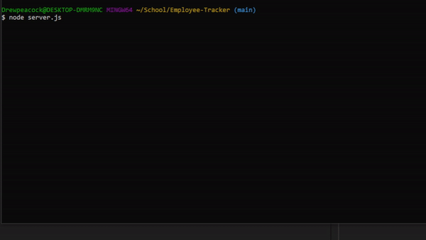
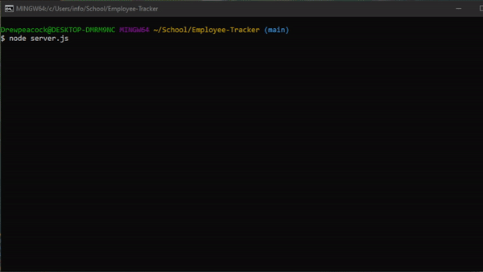

# Employee Tracker
Using an interface track and add employees and other business assets with this application.

## Description
This application allows the user to follow a series of prompts that allows you to add departments, roles, and titles with numerous details about each. Also allows the user to retrieve information about those elements from a database.

## Table of Contents
- [Installation](#installation)
- [Usage](#usage)
- [License](#license)
- [Questions](#questions)

## Installation
This Application requires [Nodejs](https://nodejs.org/) to be installed.
 
 Once you have downloaded this repository to your local machine, navigate within the command line to the folder that contains "package.json". 
 Once there type in "npm install" to the install the required dependancies inquirer, express.js, and postgres. 

## Usage
Once you have finished the installation process you can start the program by typing "node index.js" from the command line. At any point if you wish to quit you can hit CTRL + C.
  
To complete the series of prompts the user needs to type in the information for each section and hit enter to move onto the next prompt. 
  
Several prompts will present the user with a list of options. Simply use the up and down arrow keys to navigate the list.
  

The following video demonstrations should an exmaple user going through each of the prompts.

When you add a department, role, or employee you will be created with "x added successfully"
  

## License
This project is licensed under the MIT license.

## Questions
If you have any questions, please feel free to reach out to me at my GitHub: [drewhermanson](https://github.com/drewhermanson)
or by email: drew.hermanson@gmail.com
